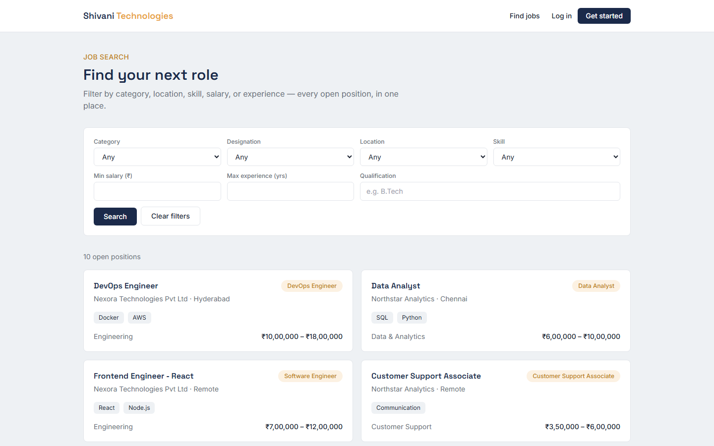
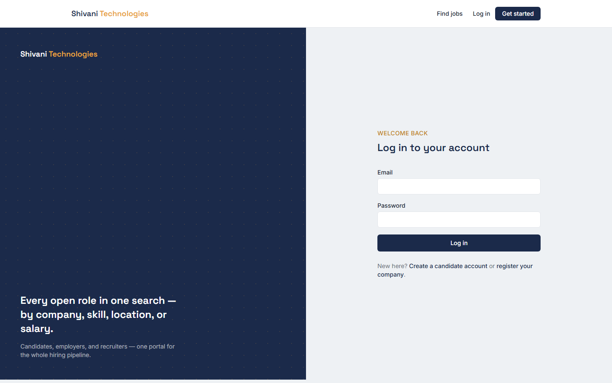
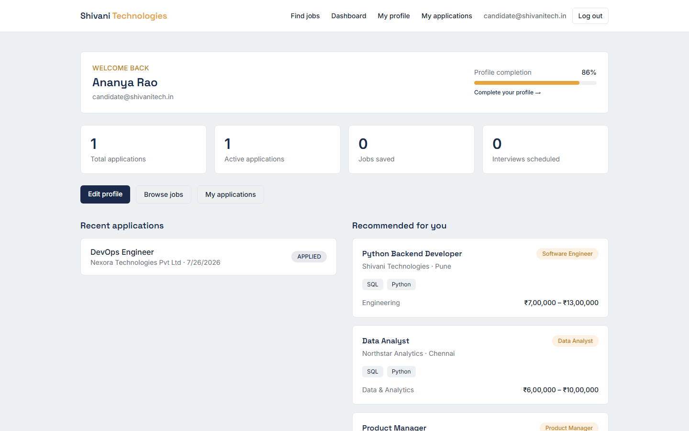
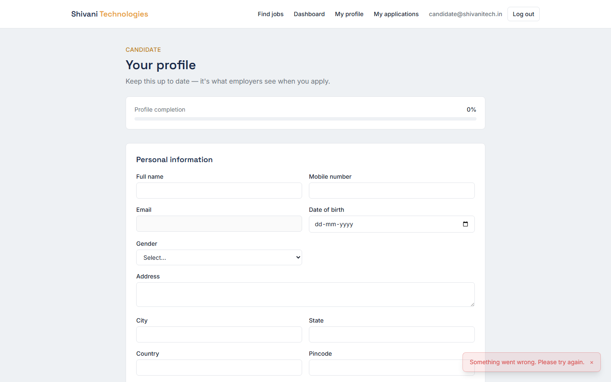
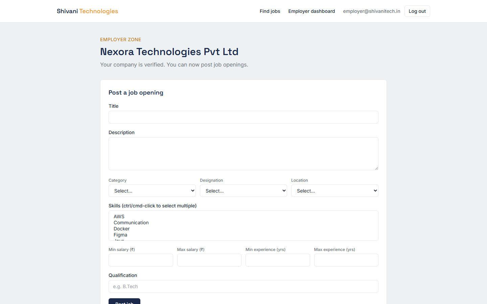
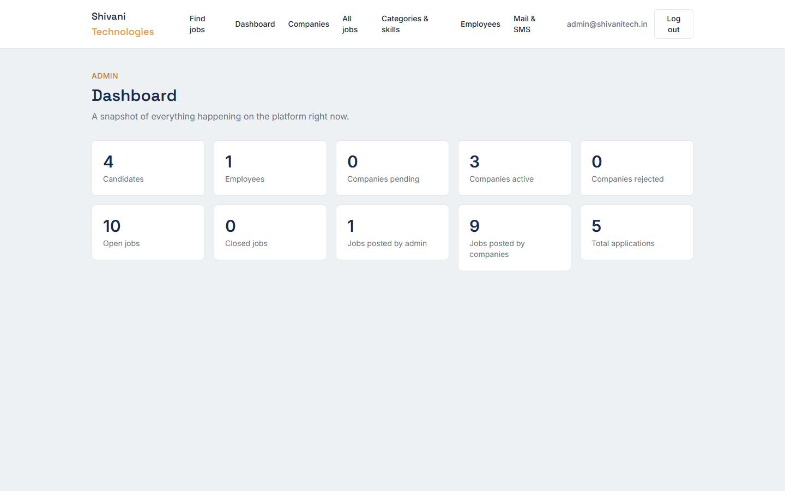
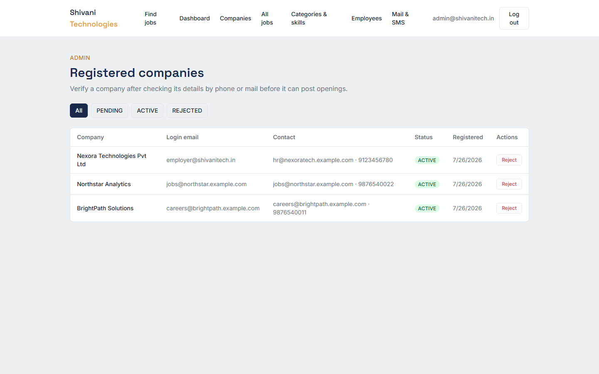
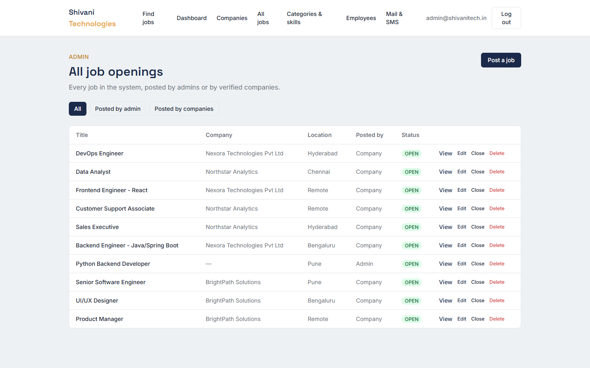

# Shivani Technologies — Job Portal

A full-stack, multi-role recruitment platform built with Spring Boot and React. Candidates search
and apply for jobs; companies register and post openings once verified; administrators run the
whole platform; internal staff get their own logins. Built, runtime-verified, and documented as a
complete submission-ready project.

## Live Deployment

| | |
|---|---|
| **Frontend** | [shivani-tech-job-portal.vercel.app](https://shivani-tech-job-portal.vercel.app) (Vercel) |
| **Backend API** | [shivani-tech-job-portal.onrender.com](https://shivani-tech-job-portal.onrender.com) (Render, Docker) |
| **API docs (Swagger)** | [shivani-tech-job-portal.onrender.com/swagger-ui/index.html](https://shivani-tech-job-portal.onrender.com/swagger-ui/index.html) |
| **Health check** | [shivani-tech-job-portal.onrender.com/actuator/health](https://shivani-tech-job-portal.onrender.com/actuator/health) |
| **Database** | TiDB Cloud Serverless (MySQL-compatible) |

Demo credentials and full deployment details (architecture, env vars, known limitations) are in
[DEPLOYMENT_REPORT.md](DEPLOYMENT_REPORT.md).

Two things worth knowing about the free-tier hosting specifically:
- Render's free tier spins the backend down after 15 minutes idle — the first request after a lull
  takes 30-50 seconds to cold-start. This is a hosting-tier characteristic, not an application bug.
- Uploaded resume files don't survive a Render redeploy (ephemeral filesystem) — use the "resume by
  URL" option for anything you want to persist through a redeploy.

## Project Overview

Shivani Technologies needed an internal job portal to manage recruitment end to end — job postings,
candidate applications, employer self-service, and administrative oversight — without relying on
third-party job boards. This project delivers that as a containerized, four-role web application.

## Problem Statement

Traditional hiring workflows split across email, spreadsheets, and third-party job boards are slow
and hard to audit. This system centralizes the entire pipeline:

- Candidates need one place to search, filter, and apply for relevant openings, and track status.
- Companies need to post openings themselves, without an admin doing it manually every time.
- Administrators need oversight and control — who's allowed to post, what's been posted, and the
  ability to reach candidates/companies/staff directly.
- Everything needs to be auditable, secure, and running in a reproducible environment.

## Features

### Administrator
- Login, JWT-based auth, role-based access control
- Full CRUD for job categories, designations, locations, and skills
- Full job CRUD (create, **edit**, close, delete) with a filter for admin-posted vs. employer-posted
- Company verification workflow (verify / reject pending company registrations)
- Employee account creation, with enable/disable control
- Targeted or broadcast email/SMS to candidates, employees, or companies
- Aggregate stats dashboard

### Candidates
- Registration with OTP email verification
- Login, JWT session
- Job search/filter by category, designation, location, skill, salary, experience, and qualification
- Apply to jobs (with duplicate-application prevention), track status in "My Applications"
- Full profile management: personal, education, professional, skills (from a managed list, plus
  free-text custom skills), and career preferences
- Resume upload (PDF) or resume-by-link, with a live profile-completion percentage
- Personal dashboard: stats, recent applications, recommended jobs
- Automatic application-confirmation email on apply

### Employer Zone
- Company self-registration
- Job posting gated behind admin verification (a company can't post until approved)
- Post, **edit**, and close their own job openings
- View their own jobs list

### Employees
- Admin-provisioned login (no public sign-up) with a designation on file
- Scoped access — cannot reach admin or employer-only routes

## Architecture

```
┌─────────────┐        HTTPS/JSON        ┌──────────────────┐        JDBC        ┌────────────┐
│   Browser   │ ───────────────────────▶ │  Spring Boot API │ ─────────────────▶ │   MySQL 8   │
│ React + Vite│ ◀─────────────────────── │  (stateless JWT) │ ◀───────────────── │            │
└─────────────┘                          └──────────────────┘                    └────────────┘
      │                                          │
      │ served by nginx (Docker)                 │ file storage (uploads volume)
      ▼                                          ▼
  static SPA build                          resume PDFs on disk
```

- **Stateless authentication**: JWT in the `Authorization` header, no server-side session state.
  Role is enforced centrally in one Spring Security filter chain (`SecurityConfig`), not scattered
  per-controller.
- **One React SPA**, role-aware routing (`ProtectedRoute`) and a shared Axios client with a global
  401 interceptor.
- **Three containers** (MySQL, backend, frontend/nginx) orchestrated by a single `docker-compose.yml`.

## Technology Stack

| Layer | Technology |
|---|---|
| Backend | Java 17, Spring Boot 3.2, Spring Security, Spring Data JPA (Hibernate 6), Lombok |
| Auth | JWT (jjwt), BCrypt password hashing |
| Database | MySQL 8 |
| Frontend | React 18, Vite, React Router, Tailwind CSS, Axios |
| Mail/SMS | JavaMailSender (any SMTP provider), Twilio SDK |
| Containerization | Docker, Docker Compose |
| Web server (frontend) | nginx |

## Folder Structure

```
shivani-tech/
  docker-compose.yml            # runs mysql + backend + frontend together
  .gitignore
  README.md                     # this file
  DEMO_GUIDE.md                 # how to demo the app
  PRESENTATION.md                # HR/interview-facing project explanation
  INSTALLATION.md                # step-by-step setup
  API_REFERENCE.md               # every REST endpoint documented
  TEST_REPORT.md                 # build/runtime/security verification results
  SCREENSHOTS.md                 # screenshot checklist for submission
  DEMO_VIDEO_SCRIPT.md           # narration script for a walkthrough video
  DEMO_SCRIPT.md                 # original quick-demo notes
  docs/
    UAT_REPORT.md                 # manual QA checklist (all 4 roles, responsive layout)
    DEPLOYMENT_CHECKLIST.md
    ENVIRONMENT_VARIABLES.md
    SECURITY_CHECKLIST.md
    BACKUP_STRATEGY.md
  scripts/
    smoke-test.sh                 # automated end-to-end API test (bash / Git Bash / WSL)
    smoke-test.bat                # same, native Windows Command Prompt
  backend/                       # Spring Boot API
    src/main/java/com/shivanitech/jobportal/
      config/        security config
      security/      JWT filter, util, user-details service
      entity/        JPA entities + enums
      repository/    Spring Data repositories
      dto/           request/response DTOs, grouped by feature
      service/       business logic
      controller/    REST endpoints
      exception/     custom exceptions + global handler
    Dockerfile
    README.md                     # backend-specific reference
  frontend/                      # React + Vite + Tailwind
    src/
      pages/         one component per route
      components/    shared UI (Navbar, Toast, JobCard, ProtectedRoute, ...)
      context/        auth context
      api/            Axios client
    Dockerfile
```

## Installation

See **[INSTALLATION.md](INSTALLATION.md)** for full step-by-step setup (Docker install, cloning,
environment variables, troubleshooting). Quick version below.

### Prerequisites
- Docker Desktop (or Docker Engine + Compose v2 on Linux)
- Git

### Docker Setup (recommended — one command)

```bash
git clone <this-repository-url>
cd shivani-tech
docker compose up --build
```

- Frontend → http://localhost:5173
- Backend API → http://localhost:8080
- MySQL is not exposed on a host port by default (avoids clashing with a local MySQL install) —
  reach it via `docker exec -it shivani-mysql mysql -uroot -proot` if you need a SQL prompt.

First boot creates all tables automatically (`ddl-auto: update`). There's no seed data baked into
the image — see **[Database Setup](#database-setup)** below, or use the demo accounts already
seeded in this submission (see **Demo Accounts** in `DEMO_GUIDE.md`).

### Manual Setup (without Docker)

**Backend:** needs MySQL running locally, then:
```bash
cd backend
mvn spring-boot:run
```
Full environment variable list in [`backend/README.md`](backend/README.md) or
[`docs/ENVIRONMENT_VARIABLES.md`](docs/ENVIRONMENT_VARIABLES.md).

**Frontend:**
```bash
cd frontend
npm install
cp .env.example .env
npm run dev
```

### Database Setup

Tables are created automatically on first boot. There's no public admin-registration endpoint (by
design — you don't want the internet creating admins), so the first admin is inserted directly:

```sql
INSERT INTO users (id, email, password, role, is_verified, is_enabled, created_at)
VALUES (UUID_TO_BIN(UUID()), 'admin@shivanitech.in', '<bcrypt-hash>', 'ADMIN', true, true, NOW());
```

**Important:** the `id` column is `binary(16)` (Hibernate 6's default UUID storage) — you must use
`UUID_TO_BIN(UUID())`, not bare `UUID()`, or the insert fails with `Data too long for column 'id'`.
This was confirmed by actually hitting that exact error against a live container during this
project's runtime verification pass.

### Running Frontend
```bash
cd frontend && npm install && npm run dev
```
Or via Docker: it's already running at http://localhost:5173 after `docker compose up`.

### Running Backend
```bash
cd backend && mvn spring-boot:run
```
Or via Docker: it's already running at http://localhost:8080 after `docker compose up`.

## API Overview

Full endpoint-by-endpoint documentation is in **[API_REFERENCE.md](API_REFERENCE.md)**. Summary:

| Area | Base path | Auth |
|---|---|---|
| Auth (register/login/OTP) | `/api/auth/**` | Public |
| Public job search/detail | `/api/jobs/**` | Public |
| Admin | `/api/admin/**` | `ROLE_ADMIN` |
| Candidate | `/api/candidate/**` | `ROLE_CANDIDATE` |
| Employer | `/api/employer/**` | `ROLE_EMPLOYER` |

## User Roles

| Role | How an account is created | Can do |
|---|---|---|
| **Administrator** | Inserted directly into the DB (no public sign-up) | Everything — lookups, jobs, companies, employees, notifications, dashboard |
| **Employer** | Public company self-registration, gated by admin verification | Post/edit/close jobs for their own company once verified |
| **Candidate** | Public registration + OTP email verification | Search/apply for jobs, manage profile/resume, view applications and dashboard |
| **Employee** | Created by an admin (no public sign-up) | Log in with a scoped, non-admin/non-employer account |

## Project Screenshots

Captured from a real running instance of the app (see **[SCREENSHOTS.md](SCREENSHOTS.md)** for the
full checklist this was based on).

| | |
|---|---|
|  Home / job search |  Login |
|  Candidate dashboard |  Candidate profile |
|  Employer dashboard |  Admin dashboard |
|  Admin — company verification |  Admin — all jobs |

## Future Enhancements

- Real email/SMS delivery (currently logs instead of sending until `MAIL_*`/`TWILIO_*` are set to
  real credentials — the code path is fully built and tested, just not connected to a live provider)
- Automated unit/integration test suite (JUnit/Vitest) — current testing is a comprehensive
  black-box API smoke test plus manual QA, not unit-level
- Rate limiting on authentication endpoints
- Resume viewing for employers/admins reviewing an application
- N+1 query optimization on job listing endpoints for larger datasets
- Move uploaded resumes to S3-compatible object storage (the current live deployment's filesystem
  is ephemeral — see **[DEPLOYMENT_REPORT.md](DEPLOYMENT_REPORT.md)**)

## Known Limitations

- No real email/SMS provider configured out of the box — see `docs/ENVIRONMENT_VARIABLES.md` to
  connect one
- `JWT_SECRET` ships with a placeholder default for local/manual setups — the live deployment uses
  a real generated secret, but change the placeholder before any deployment of your own
- No rate limiting on login/OTP endpoints yet
- TLS/HTTPS is handled automatically by Vercel and Render on the live deployment; if you self-host
  instead (e.g. your own VPS via `docker-compose.yml`), put nginx/Caddy in front for HTTPS yourself

## License

This project was built as an internal assignment for Shivani Technologies. No open-source license
is declared; all rights reserved by the author unless otherwise agreed with Shivani Technologies.

## Author

Built as a job-portal assignment submission. Contact details available on request.
